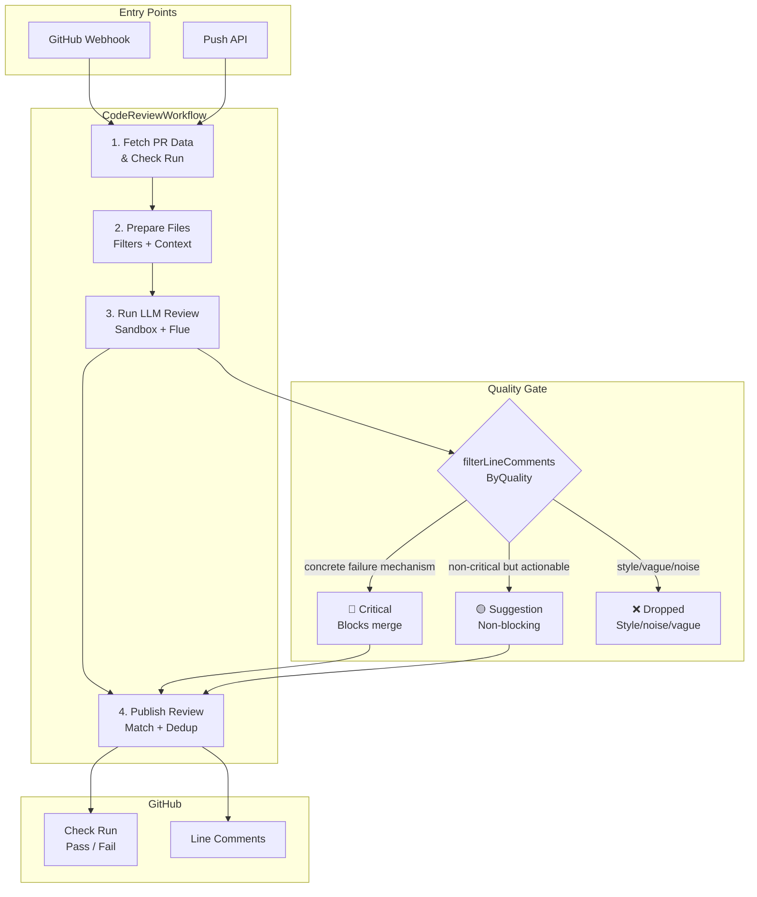

# 🤖 Codex Code Review Assistant

An AI-powered code review assistant that provides automated, line-specific feedback on pull requests using Codex AI. Designed to work seamlessly with **GitHub private repositories**.

## ✨ Features

- **Automatic PR Reviews**: Triggers on PR creation and updates
- **Manual Re-trigger**: Re-run reviews by commenting `@donmerge` (configurable via `REVIEW_TRIGGER`)
- **Line-Specific Comments**: Provides feedback on exact lines in the diff
- **Comment Deduplication**: Avoids repeating the same issue across re-runs
- **Stable Issue Keys**: Tracks findings from normalized issue identity instead of comment wording
- **Auto-Resolve Fixed Issues**: Marks previous comments as fixed when addressed
- **GitHub Check Runs**: Creates actionable check runs with pass/fail status
- **Critical Issue Detection**: Fails PRs with security vulnerabilities, logic errors, or breaking changes
- **Configurable Base Branch**: Works with any base branch (default: `main`)
- **Private Repository Support**: Secure handling of private code
- **Codex Integration**: Uses Codex completions models for intelligent code analysis

## 🏗 Architecture

DonMerge runs as a Cloudflare Worker. When a review is triggered, a **Cloudflare Workflow** executes a 4-step durable pipeline. A **Quality Gate** filters findings before publishing — only concrete, high-confidence issues with a described failure mechanism can block a merge.



For the full architecture document with detailed diagrams, see [docs/ARCHITECTURE.md](./docs/ARCHITECTURE.md).

## 🚀 Quick Start

### Prerequisites

- GitHub repository (public or private)
- OpenAI API key with access to Codex models
- Node.js 22+ (for local testing)

### 1. Add Required Secrets

Navigate to your repository settings:

```
Settings → Secrets and variables → Actions → New repository secret
```

Add these secrets:

| Secret Name | Description | How to Get |
|-------------|-------------|------------|
| `OPENAI_API_KEY` | OpenAI API key for Codex | [Get from OpenAI](https://platform.openai.com/api-keys) |

### 2. Configure Repository Variables (Optional)

Navigate to:

```
Settings → Secrets and variables → Actions → Variables
```

| Variable Name | Default | Description |
|--------------|---------|-------------|
| `CODEX_MODEL` | `codex-5.3` | Codex model to use (`codex-5.2` or `codex-5.3`) |
| `BASE_BRANCH` | `main` | Target branch for reviews |
| `MAX_REVIEW_FILES` | `50` | Maximum files to review per PR |
| `AUTO_REVIEW_ON_PR` | `true` | Enable automatic reviews on PR creation |
| `FAIL_ON_CRITICAL` | `true` | Fail check on critical issues |
| `REVIEW_TIMEOUT` | `300` | Review timeout in seconds |
| `CUSTOM_REVIEW_INSTRUCTIONS` | `""` | Domain-specific review guidance |
| `REVIEW_TRIGGER` | `@donmerge` | Mention tag that triggers manual re-reviews on PR comments |
| `LOG_LEVEL` | `info` | Logging verbosity |

### 3. Verify Setup

1. Open a new pull request targeting your configured base branch
2. The review should trigger automatically
3. Check the "Actions" tab for workflow progress
4. Review results appear as:
   - Check run in the PR checks section
   - Line-specific comments on the diff
   - Summary comment with statistics

### 4. Manual Re-trigger

To re-run a review (e.g., after fixing issues):

```
@donmerge
```

Comment this on any PR to trigger a new review. The default trigger tag is `@donmerge`; set the `REVIEW_TRIGGER` environment variable to change it (e.g. `REVIEW_TRIGGER=@mybot`).

## 📖 Usage

### Automatic Review

Reviews trigger automatically when:
- PR is **opened**
- PR receives **new commits** (synchronize)
- PR is **reopened**

**Note**: Only reviews PRs targeting the configured `BASE_BRANCH`.

### Manual Review

Comment on any PR:

```
@donmerge
```

Additional context (optional):

```
@donmerge

Please focus on security vulnerabilities and performance issues.
```

### Review Output

#### Check Run Status

| Status | Meaning |
|--------|---------|
| ✅ **Success** | No blocking issues found, PR is safe to merge |
| ❌ **Failure** | Blocking issues detected, review required |
| ⏱️ **Timed Out** | Review exceeded maximum duration |
| ⚠️ **Partial** | Large PR, only critical files reviewed |

#### Line Comments

| Label | Blocking? | Criteria |
|-------|-----------|----------|
| 🔴 **Issue** | **Yes** — fails the check run | Concrete finding with a described failure mechanism (security vulnerability, data loss, race condition, runtime error, broken logic) |
| 🟡 **Suggestion** | No — informational only | Non-critical finding that is concrete and actionable, but lacks a blocking failure mechanism |
| *(filtered)* | N/A | Style, PHPDoc, import ordering, vague advisory ("ensure", "consider") — automatically removed by the quality gate |

**What blocks a merge:** Only 🔴 **Issue** comments with severity `critical` AND a concrete failure mechanism (e.g., "leads to SQL injection", "causes null dereference", "results in data loss"). Generic or vague findings — even at critical severity — are filtered out.

**What doesn't block:** 🟡 Suggestions, style-related findings, PHPDoc/docblock comments, import ordering, naming conventions, and advisory comments without a described code path.

#### Comment Lifecycle

- Existing DonMerge comments are deduplicated on re-runs
- Fixed issues are acknowledged once with a ✅ reply and won't be re-resolved on later runs

### Example Review

```markdown
## ✅ Code Review Passed

This PR implements user authentication with proper security practices.

### 📊 Review Statistics
- **Files Reviewed**: 5
- **Critical Issues**: 0
- **Suggestions**: 3

### 💡 Suggestions
- Consider adding rate limiting to the login endpoint
- Add JSDoc comments to public functions
- Extract validation logic to a separate module
```

### Quality Calibration

#### Why the Change

An audit of 100 PRs found that ~80% of LLM-generated inline findings were generic, vague, or style-related — not true blocking issues. Comments like "Ensure all errors are handled" or "Consider adding PHPDoc" created noise without identifying concrete risks. The quality gate was introduced to ensure only findings with a **described failure mechanism** can block a merge.

#### How It Works

After the LLM produces findings, a deterministic post-processing step (`filterLineCommentsByQuality`) applies three checks:

1. **Style/Noise filter** — Drops comments about PHPDoc, imports, formatting, naming, refactoring, etc.
2. **Vague advisory filter** — Drops comments using "ensure", "verify", "consider", "may", "could" without explaining the exact code path that fails.
3. **Concrete failure mechanism check** — Critical findings must describe what happens (e.g., "leads to SQL injection", "causes null dereference"). Critical findings without a mechanism are dropped or downgraded.

Non-critical findings that pass the quality gate are labeled 🟡 **Suggestion** (non-blocking). Only critical findings with a concrete mechanism remain 🔴 **Issue** (blocking).

#### What Blocks vs. What Doesn't

| Finding | Blocks? | Why |
|---------|---------|-----|
| "This SQL query concatenates user input directly — leads to SQL injection" | ✅ Yes | Critical domain + concrete mechanism |
| "Consider adding rate limiting to the login endpoint" | ❌ No | Vague advisory, no failure mechanism |
| "Race condition in `updateBalance` — concurrent writes can corrupt balance" | ✅ Yes | Critical domain + concrete mechanism |
| "Ensure all async errors are handled" | ❌ No | Vague advisory, no specific code path |
| "Missing PHPDoc on `getUserById`" | ❌ No | Style/noise, filtered out |
| "Import ordering should be alphabetical" | ❌ No | Style/noise, filtered out |

#### Configuration

The quality gate is always active. You can adjust severity per-path using the `.donmerge` config file:

```yaml
severity:
  "src/auth/**": "critical"      # Elevate auth findings
  "docs/**": "suggestion"         # Demote doc findings
  "**/*.config.ts": "low"         # Minimize config file noise
```

## ⚙️ Configuration

### Environment Variables

Create `.env` file (use `.env.example` as template):

```bash
# Required
OPENAI_API_KEY=sk-...

# Optional (with defaults)
CODEX_MODEL=codex-5.3
BASE_BRANCH=main
MAX_REVIEW_FILES=50
AUTO_REVIEW_ON_PR=true
FAIL_ON_CRITICAL=true
REVIEW_TIMEOUT=300
REVIEW_TRIGGER=@donmerge
LOG_LEVEL=info
```

### GitHub Actions Permissions

The workflow requires these permissions:

```yaml
permissions:
  contents: read        # Read repository contents
  pull-requests: write  # Post review comments
  checks: write         # Create check runs
  issues: read          # Read PR metadata
```

### Branch Protection

To enforce code reviews:

1. Go to **Settings → Branches → Branch protection rules**
2. Add rule for your base branch
3. Enable "Require status checks to pass before merging"
4. Select "Codex Code Review" check

## 🔧 Advanced Customization

### Custom Review Instructions

Add domain-specific guidance:

**Repository Variable**: `CUSTOM_REVIEW_INSTRUCTIONS`

```markdown
Focus on:
- Security vulnerabilities (OWASP Top 10)
- Performance issues (N+1 queries, memory leaks)
- Healthcare data privacy (HIPAA compliance)
- Error handling for external API calls
```

### `.donmerge` Configuration File

Each reviewed repository can include a `.donmerge` file in its root to customise review behaviour — file filtering, severity overrides, additional LLM context, and project-specific instructions.

#### What is `.donmerge`?

A YAML configuration file placed at the repository root. It is fetched and parsed on every review (best-effort — a missing or invalid file never fails a review). Think of it as per-repo settings that travel with the code.

#### Full Example

```yaml
# .donmerge
version: "1"

# Files to exclude from review (glob patterns)
exclude:
  - "*.test.ts"
  - "*.spec.ts"
  - "*.generated.ts"
  - "dist/**"
  - "build/**"
  - "vendor/**"

# Files to always include, even if matched by exclude (include overrides exclude)
include:
  - "dist/important-entry.ts"

# Additional context files fed to the LLM reviewer (max 10 files, 20 KB each, 50 KB total)
skills:
  - path: "DESIGN.md"
    description: "System architecture and design decisions"
  - path: "docs/API_CONVENTIONS.md"
    description: "REST API naming and error-handling conventions"
  - path: "CONTRIBUTING.md"
    description: "Project coding standards"

# Custom instructions appended to the review prompt
instructions: |
  Focus on:
  - Security vulnerabilities (OWASP Top 10)
  - Performance issues (N+1 queries, memory leaks)
  - Error handling for external API calls

# Per-path severity overrides (glob pattern → severity level)
severity:
  "src/middleware/**": "critical"
  "**/*.config.ts": "low"
  "docs/**": "suggestion"
```

#### Field Reference

| Field | Type | Description |
|-------|------|-------------|
| `version` | `string` | Schema version. Currently `"1"`. |
| `exclude` | `string[]` | Glob patterns for files to **skip** during review. |
| `include` | `string[]` | Glob patterns that **override** exclude — matched files are always reviewed. |
| `skills` | `{path, description}[]` | Up to 10 repo files fetched as additional LLM context (max 20 KB each, 50 KB total). |
| `instructions` | `string` | Free-form text appended to the review prompt for domain-specific guidance. |
| `severity` | `map<string, "critical"\|"suggestion"\|"low">` | Glob-pattern → severity-level overrides for files matching the pattern. |

#### Example Use Cases

- **Monorepo**: Exclude generated code and vendored dependencies while keeping `src/` under review.
- **Security-critical paths**: Elevate `src/auth/**` and `src/middleware/**` to `critical` severity.
- **Project conventions**: Reference `DESIGN.md` or `CONTRIBUTING.md` as skills so the reviewer understands your architecture.
- **Domain-specific instructions**: Tell the reviewer to focus on HIPAA compliance, payment logic, or public API stability.

#### Exclude Pattern Pitfalls

Broad exclude patterns can unintentionally hide important files from review. Keep these guidelines in mind:

1. **Avoid overly broad excludes** — patterns like `*.json`, `*.yaml`, or `*.md` can silence review across the entire repository, including configuration and manifest files that often contain security-relevant settings.
2. **Prefer targeted secret patterns** — instead of `*.env*`, exclude specific paths like `secrets/**` or `.env.local`. This keeps shared `.env.example` or `.env.defaults` files under review.
3. **Use include overrides when broad excludes are necessary** — if you must exclude `*.json` to skip generated schemas, add explicit include entries for files that matter:
   ```yaml
   exclude:
     - "*.json"
   include:
     - "package.json"
     - "tsconfig.json"
     - ".eslintrc.json"
   ```
4. **Remember that include overrides exclude** — a file matched by both `exclude` and `include` will be **included** in the review. The `include` list always wins.

### Flue Architecture

DonMerge uses [Flue](https://github.com/withastro/flue) for LLM orchestration inside a Cloudflare Workflow pipeline:

1. The **CodeReviewWorkflow** (Cloudflare Workflow) orchestrates the 4-step review pipeline with durable retries and timeouts
2. Each review runs in a Cloudflare **Sandbox container**
3. Flue's `@flue/cloudflare` runtime starts an **OpenCode server** inside the container
4. The OpenCode server proxies requests to the **OpenAI API** directly (not Cloudflare Workers AI)
5. The `OPENAI_API_KEY` is injected into the container environment at runtime
6. After the LLM responds, the **Quality Gate** filters findings before publishing to GitHub

#### Output Format Instructions

When `FlueClient.prompt()` is called with a `result` schema, it automatically appends `---RESULT_START---` and `---RESULT_END---` delimiter instructions to the prompt. The model is expected to wrap its output between these delimiters so Flue can extract the result.

**Important for prompt authors**: Avoid writing conflicting instructions like "Return ONLY valid JSON" in your prompts, since Flue's delimiter instructions already describe the output format. Use phrasing like "Produce your review as JSON matching this schema" instead.

The review processor includes a **fallback extraction** mechanism: if Flue's delimiter extraction fails, it attempts to parse the raw model response as JSON directly using multi-strategy extraction (code fences, JSON boundaries).

### Multiple Base Branches

To review PRs targeting different branches:

1. **Option A**: Create separate workflow files
   ```yaml
   # .github/workflows/code-review-develop.yml
   on:
     pull_request:
       branches: [develop]
   ```

2. **Option B**: Use repository variable
   ```
   BASE_BRANCH=develop
   ```

### Model Selection

Choose between Codex versions:

| Model | Type | Strengths | Use Case |
|-------|------|-----------|----------|
| `gpt-5.2-codex` | Completions | Balanced speed and accuracy | General code review |
| `gpt-5.3-codex` | Completions | Enhanced detection, faster | Security-critical projects |

Note: `gpt-5.3-codex` uses the legacy completions API (`/v1/completions`), not the chat completions API. This affects how the model handles structured output instructions.

## 🐛 Troubleshooting

### Review Not Triggering

**Symptoms**: No review on PR creation

**Solutions**:
1. Check workflow is enabled in Actions tab
2. Verify `AUTO_REVIEW_ON_PR` is `true`
3. Confirm PR targets the correct base branch
4. Check Actions logs for errors

### Authentication Errors

**Symptoms**: "Permission denied" or "Unauthorized"

**Solutions**:
1. Verify `OPENAI_API_KEY` secret is set correctly
2. Check API key has access to Codex models
3. Ensure API key hasn't expired
4. Verify `GITHUB_TOKEN` permissions in workflow

### No Line Comments

**Symptoms**: Review completes but no comments on diff

**Solutions**:
1. Check if files exceed `MAX_REVIEW_FILES` limit
2. Verify files aren't excluded by `.donmerge` exclude patterns
3. Review workflow logs for API errors
4. Ensure PR has actual code changes (not just renames)

### Check Run Not Created

**Symptoms**: Review runs but no check appears

**Solutions**:
1. Verify workflow has `checks: write` permission
2. Check if repository has branch protection enabled
3. Look for errors in workflow logs
4. Ensure `GITHUB_TOKEN` is provided

### Timeout Errors

**Symptoms**: "Review exceeded maximum duration"

**Solutions**:
1. Increase `REVIEW_TIMEOUT` variable
2. Reduce `MAX_REVIEW_FILES` to limit scope
3. Add more files to `.donmerge` exclude patterns
4. Consider breaking large PRs into smaller ones

### Quota / Rate Limit Errors
**Error Code**: `DM-E006`

**Symptoms**: "Flue prompt failed" with "insufficient_quota", "rate limit", or "You exceeded your current quota"

**Solutions**:
1. Check your OpenAI billing dashboard for quota usage
2. Upgrade your OpenAI plan if needed
3. Wait for rate limit to reset (typically 1 minute for rate limits, billing cycle for quota)
4. Reduce review frequency with larger PRs or manual triggers only

### Private Repository Issues

**Symptoms**: Can't access private repo code

**Solutions**:
1. Workflow runs in your repository context (has access)
2. Ensure `GITHUB_TOKEN` is not restricted
3. Check repository visibility settings
4. Verify workflow has `contents: read` permission

## 🏷️ Error Codes

When DonMerge encounters an error, it shows a short error code on the PR check run instead of the raw error. Full error details are available in worker logs.

| Code | Name | Description |
|------|------|-------------|
| `DM-E001` | LLM Failure | The AI model failed to process the review (prompt errors, model response parsing, Flue delimiter issues) |
| `DM-E002` | Max Attempts | The review exceeded the maximum retry attempts |
| `DM-E003` | GitHub API | A GitHub API request failed during the review |
| `DM-E004` | Invalid Output | The model produced invalid output after all retries |
| `DM-E005` | Internal Error | An unexpected internal error occurred |
| `DM-E006` | Quota Limit | The AI model API quota or rate limit has been exceeded |

### Code in Check Run Output

Failed check runs show a compact error code instead of verbose internal details:

```
🤠 DonMerge hit a snag [DM-E001]
Error code: DM-E001 — The AI model failed to process the review.
```

Full error details (model name, error message, stack traces) are written to `console.error` and are available in Cloudflare worker logs.

## 🔒 Security Considerations

### Data Privacy

- ✅ Code diffs processed only in GitHub Actions environment
- ✅ No external data persistence beyond OpenAI API
- ✅ Logs sanitized to remove sensitive information
- ✅ API keys stored securely in GitHub Secrets

### Access Control

- ✅ Uses minimal required permissions
- ✅ `GITHUB_TOKEN` automatically scoped to repository
- ✅ No additional OAuth or app installation required
- ✅ Respects branch protection rules

### Best Practices

1. **Limit API Key Scope**: Use separate OpenAI API keys per project
2. **Review Permissions**: Audit workflow permissions regularly
3. **Monitor Usage**: Track API usage to detect anomalies
4. **Rotate Secrets**: Periodically rotate API keys
5. **Audit Logs**: Review Actions logs for suspicious activity

## 📊 Monitoring

### Workflow Metrics

Track in GitHub Actions:
- Review duration
- Success/failure rate
- API call frequency

### API Usage

Monitor OpenAI API usage to avoid quota errors (`DM-E006`):
```bash
curl https://api.openai.com/v1/usage \
  -H "Authorization: Bearer $OPENAI_API_KEY"
```

### Logging

Adjust verbosity with `LOG_LEVEL`:
- `debug`: Detailed execution logs
- `info`: General progress (default)
- `warn`: Warnings only
- `error`: Errors only

## 🤝 Contributing

### Local Development

```bash
# Clone repository
git clone https://github.com/your-org/your-repo.git
cd your-repo

# Install dependencies
npm install

# Set up environment
cp .env.example .env
# Edit .env with your API keys

# Test workflow locally
npx flue run .flue/workflows/code-review.ts \
  --args '{"prNumber": 123, "baseBranch": "main"}' \
  --model codex-5.3
```

### Testing Changes

1. Create test PR in development repository
2. Trigger review with `@donmerge`
3. Verify output and behavior
4. Check all edge cases (large PRs, binary files, etc.)

## 📝 License

MIT License - See LICENSE file for details

## 🆘 Support

- **Documentation**: This file
- **Issues**: Open a GitHub issue
- **Discussions**: GitHub Discussions for questions
- **Security Issues**: Email security@your-org.com

## 🗺️ Roadmap

- [ ] Support for GitLab repositories
- [ ] Integration with SonarQube
- [x] Custom rule sets per repository (via `.donmerge`)
- [ ] Batch review for multiple PRs
- [ ] Slack/Teams notifications
- [ ] Review analytics dashboard

---

**Built with ❤️ using Flue and Codex AI**
