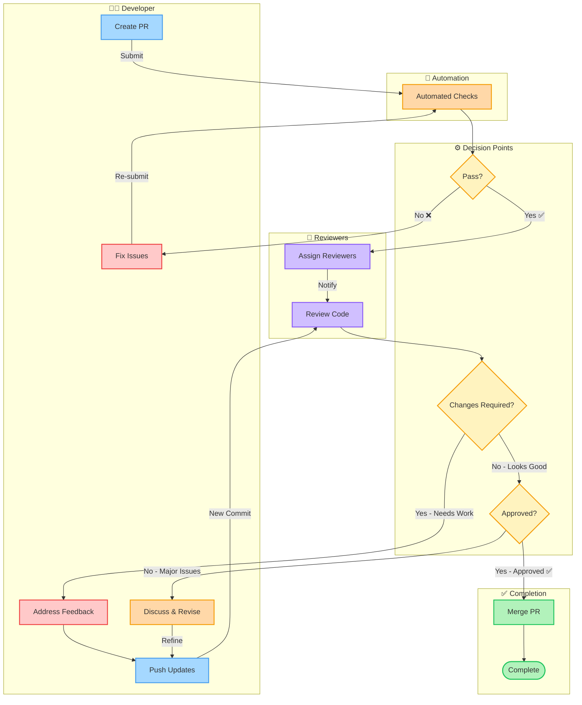

# Code Review Process

This document outlines the complete code review workflow for our project.

## Process Diagram

## Process Steps

### 1. Create Pull Request
Developer creates a PR with a clear description of changes.

### 2. Automated Checks
CI/CD pipeline runs:
- ✅ Linting
- ✅ Unit Tests
- ✅ Integration Tests
- ✅ Build Verification

### 3. Assign Reviewers
Once automated checks pass, reviewers are assigned based on:
- Code ownership
- Expertise area
- Availability

### 4. Code Review
Reviewers examine:
- Code quality & style
- Logic correctness
- Test coverage
- Documentation
- Security concerns

### 5. Feedback Loop
If changes are required:
- Developer addresses feedback
- Pushes new commits
- Re-request review

### 6. Approval & Merge
After approval from all required reviewers:
- PR is merged to target branch
- Branch cleanup (optional)

## Review Checklist

- [ ] Code follows project style guidelines
- [ ] All tests pass
- [ ] New code is properly tested
- [ ] Documentation is updated
- [ ] No security vulnerabilities
- [ ] Performance implications considered
- [ ] Breaking changes documented

## Roles & Responsibilities

| Role | Responsibility |
|------|----------------|
| **Author** | Create quality PR, respond to feedback, keep PR updated |
| **Reviewer** | Thoroughly review code, provide constructive feedback, approve/reject |
| **Automation** | Run CI checks, enforce branch protection rules |

---

> 📝 This diagram is also available as an Excalidraw file: `code-review-process.excalidraw`
