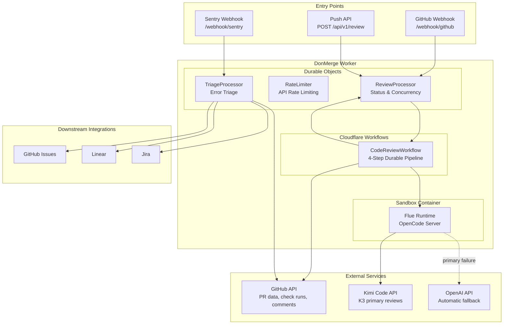
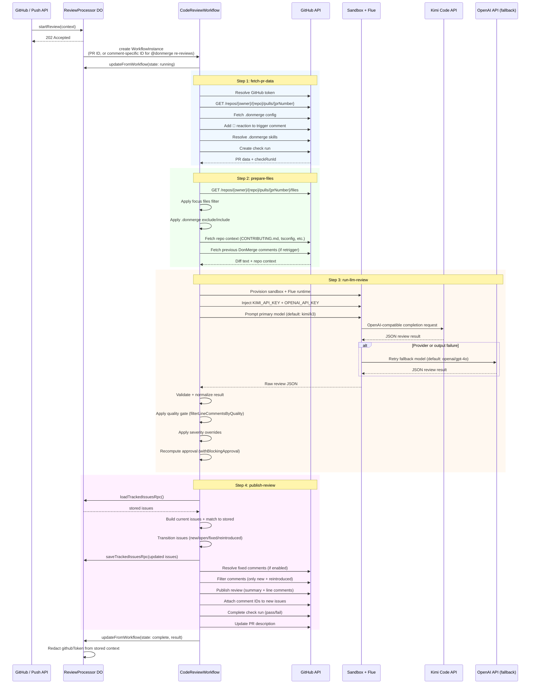
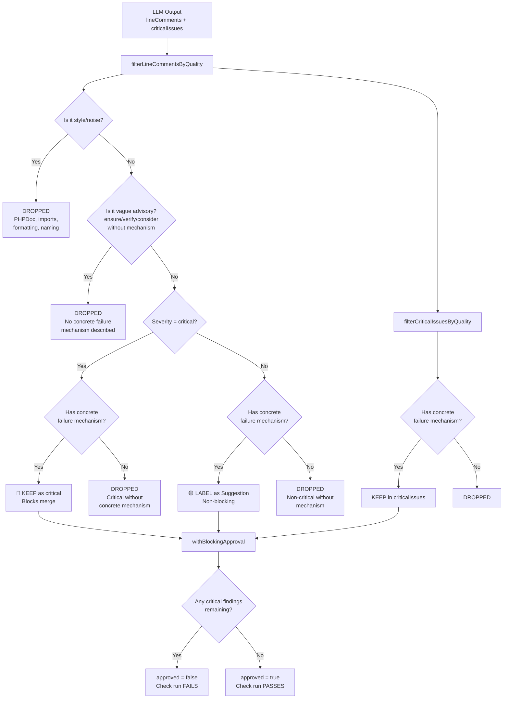
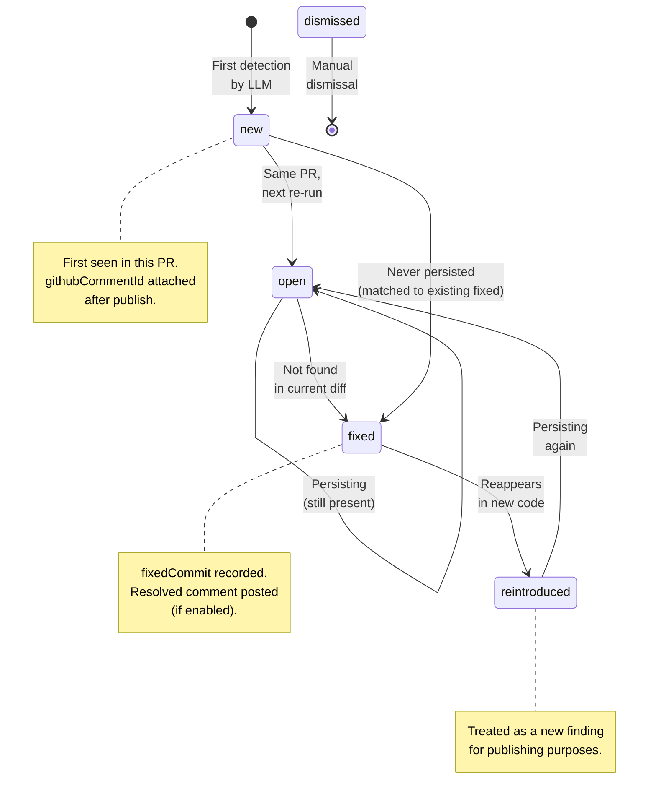
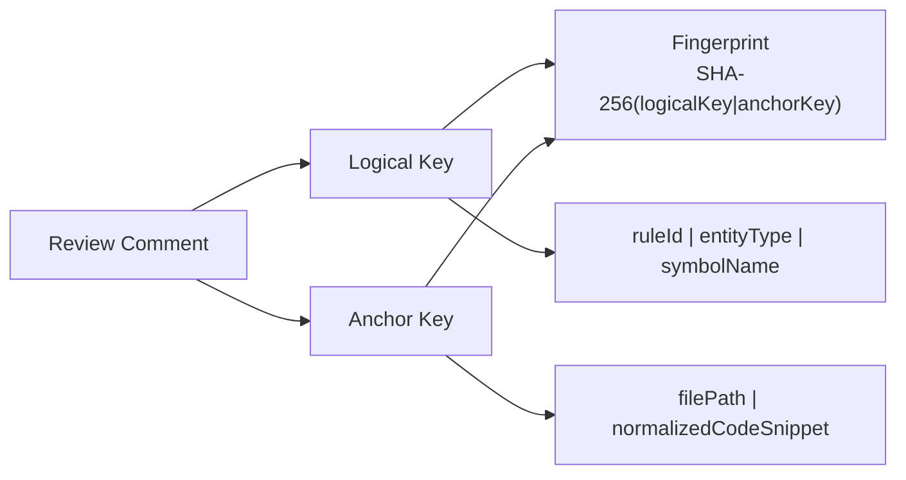
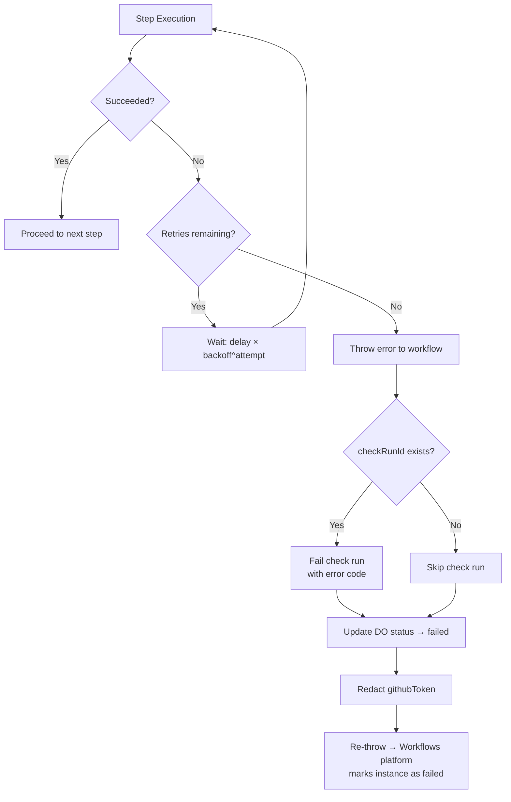
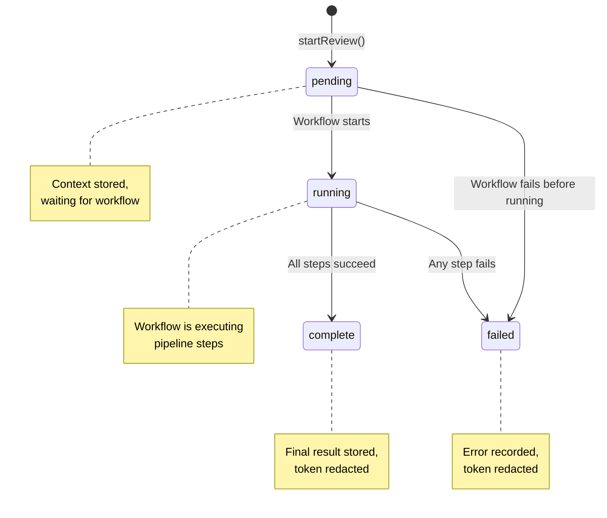

# DonMerge Architecture

This document describes the system architecture of DonMerge — an AI-powered code review and Sentry triage service running on Cloudflare Workers.

---

## Table of Contents

- [System Overview](#system-overview)
- [Code Review Pipeline](#code-review-pipeline)
- [Quality Calibration System](#quality-calibration-system)
- [Issue Tracking Lifecycle](#issue-tracking-lifecycle)
- [Error Handling and Retries](#error-handling-and-retries)
- [Configuration](#configuration)

---

## System Overview

DonMerge is a Cloudflare Worker that receives code review requests via GitHub webhooks or a Push API, processes them through a durable Cloudflare Workflow pipeline, and publishes results back to GitHub as check runs and line comments.



### Component Responsibilities

| Component | Role |
|-----------|------|
| **ReviewProcessor DO** | Stores review context and status, provides RPC methods for workflow. Does NOT execute the review — that's the workflow's job. |
| **CodeReviewWorkflow** | 4-step durable pipeline: fetch PR data → prepare files → run LLM review → publish review. Retries with exponential backoff. |
| **Sandbox + Flue** | Cloudflare container running OpenCode. It registers Kimi Code as an OpenAI-compatible `kimi` provider for primary reviews and retains built-in OpenAI for automatic fallback. |
| **RateLimiter DO** | Enforces API rate limits for Push API keys (per-key: 30 req/min for live, 10 req/min for test). |
| **TriageProcessor DO** | Handles Sentry error triage — root cause analysis and auto-fix PR creation. |

---

## Code Review Pipeline

The code review pipeline is a Cloudflare Workflow (`CodeReviewWorkflow`) with 4 durable steps. Each step has configurable retries and timeouts.



### Step Configuration

| Step | Retries | Timeout | Backoff |
|------|---------|---------|---------|
| `fetch-pr-data` | 3 | 2 minutes | Exponential |
| `prepare-files` | 2 | 2 minutes | Exponential |
| `run-llm-review` | 2 | 5 minutes | Exponential |
| `publish-review` | 2 | 3 minutes | Exponential |

### Deterministic Workflow IDs

Regular PR events use a stable Workflow ID: `review-{owner}-{repo}-{prNumber}`. A comment-triggered `@donmerge` re-review adds the GitHub comment ID: `review-{owner}-{repo}-{prNumber}-comment-{commentId}`.

This ensures that:
- The ReviewProcessor DO still provides one concurrency/status scope per PR
- Duplicate delivery of the same webhook maps to the same workflow instance
- A later comment re-review runs with its **fresh** webhook payload (installation credentials, focus files, and instructions), rather than restarting stale workflow params
- Status queries retain the stable PR-level job ID

---

## Quality Calibration System

DonMerge implements a post-LLM quality gate that filters out generic, vague, or style-only findings. This prevents noise from blocking PRs and ensures only concrete, high-confidence issues affect the approval decision.

### Background

An audit of 100 PRs found that approximately 80% of LLM-generated inline findings were generic, vague, or style-related — not true blocking issues. The quality gate was introduced to separate real correctness risks from noise.

### How the Quality Gate Works



### Pattern Detection

The quality gate uses three categories of regex patterns:

| Pattern Category | Examples | Effect |
|-----------------|----------|--------|
| **Style/Noise** | PHPDoc, imports alphabetical, formatting, refactoring, naming convention | Dropped unless critical domain match |
| **Vague Advisory** | "ensure", "verify", "consider", "may", "could" without failure mechanism | Dropped |
| **Concrete Failure** | "leads to", "causes", "results in", "allows", "crashes", "throws" | Required for blocking |
| **Critical Domain** | SQL injection, XSS, auth, data loss, race condition, null dereference | Elevates severity |
| **Vulnerability Mechanism** | "unsanitized", "unescaped", "attacker-controlled", "directly concatenated" | Combined with critical domain |

### What Blocks vs. What Doesn't

| Finding Type | Before Calibration | After Calibration |
|-------------|-------------------|-------------------|
| 🔴 SQL injection with concrete path | Blocks | Blocks |
| 🔴 "Consider adding auth" (no mechanism) | Blocks | **Dropped** |
| 🟡 Race condition in critical section | Non-blocking | **Blocks** (reclassified) |
| 🟡 "Ensure all errors are handled" | Non-blocking | **Dropped** |
| 🔴 PHPDoc missing on public method | Blocks | **Dropped** |
| 🟡 "Import ordering should be alphabetical" | Non-blocking | **Dropped** |

---

## Issue Tracking Lifecycle

DonMerge tracks findings across re-runs using deterministic fingerprints. Each issue has a stable identity that survives code changes, comment rewording, and line number shifts.

### State Machine



### Fingerprinting

Each issue is identified by a deterministic fingerprint computed from:



| Key | Composition | Purpose |
|-----|-------------|---------|
| **logicalKey** | `{ruleId}\|{entityType}\|{symbolName}` | Identifies the *type* of issue (e.g., "sql-injection\|method\|getUserById") |
| **anchorKey** | `{filePath}\|{normalizedCodeSnippet}` | Identifies the *location* of issue (file + surrounding code) |
| **fingerprint** | `SHA-256(logicalKey\|anchorKey)` | Unique identifier for exact matching |

### Match Strategy

When matching current findings to stored issues:

1. **Exact fingerprint match** — same logical key AND same anchor key
2. **Logical key match** — same rule/entity/symbol (code moved but issue is the same)
3. **Anchor key match** — same file and code snippet (rule wording changed)

### Issue Reconciliation on Re-runs

When a re-trigger occurs, previous DonMerge comments are fetched and used to:
- Reconcile issue keys for stable identity across re-runs
- Sync tracked issues with GitHub comment IDs
- Deduplicate comments (only new + reintroduced issues get published)

---

## Error Handling and Retries

### Workflow Step Retries

Each workflow step has independent retry configuration with exponential backoff:



### Check Run Failure on Workflow Error

When any step fails after a check run has been created, the workflow:
1. Calls `failCheckRun()` with a classified error code (DM-E001 through DM-E006)
2. Updates the DO status to `failed`
3. Redacts the GitHub token from stored context
4. Re-throws the error so the Workflows platform records the failure

### DO Status State Machine



### Token Redaction

On completion or failure, the DO redacts the GitHub token from stored review context:

```typescript
// processor.ts — updateFromWorkflow()
if (update.state === 'complete' || update.state === 'failed') {
  storedContext.githubToken = undefined;
  await this.state.storage.put(STATE_KEYS.context, storedContext);
}
```

This ensures tokens are not persisted in DO storage after the review lifecycle ends.

### Workflow Output Credential Rule

Cloudflare Workflow step outputs are inspectable through the Workflows API and CLI. Never return a GitHub token or any other credential in a step's serialized return value. Resolve credentials inside the step that uses them, or keep them in internal storage that is not exposed as step output.

---

## Configuration

### Environment Variables

| Variable | Required | Description |
|----------|----------|-------------|
| `KIMI_API_KEY` | Yes | Kimi Code key for the primary `kimi/k3` provider registered in OpenCode |
| `OPENAI_API_KEY` | Yes | OpenAI key for the automatic fallback provider |
| `FALLBACK_MODEL` | No | Fallback model (default: `openai/gpt-4o`) when the primary provider fails |
| `GITHUB_WEBHOOK_SECRET` | Webhook mode | HMAC secret for webhook signature validation |
| `GITHUB_APP_ID` | Webhook mode | GitHub App ID for installation token resolution |
| `GITHUB_APP_PRIVATE_KEY` | Webhook mode | GitHub App private key (PEM format) |
| `CODEX_MODEL` | No | Primary LLM model (default: `kimi/k3`). Format: `provider/model` |
| `MAX_REVIEW_FILES` | No | Maximum files per PR review (default: `50`) |
| `REPO_CONFIGS` | No | Per-repo base branch config: `owner/repo:branch,...` |
| `REVIEW_TRIGGER` | No | Comment trigger tag (default: `@donmerge`) |
| `DONMERGE_POST_FIXED_REPLIES` | No | Post ✅ replies on fixed issues (`true`/`false`) |
| `DONMERGE_API_KEYS` | Push API | Comma-separated API keys (`dm_live_*`, `dm_test_*`) |
| `SENTRY_WEBHOOK_SECRET` | Sentry | HMAC secrets for Sentry webhook verification |
| `SENTRY_REPO_MAP` | Sentry | Maps Sentry org slugs to GitHub repos |
| `SENTRY_GITHUB_TOKEN` | Sentry | GitHub token for Sentry-triggered code fetching |
| `TENANT_ENCRYPTION_KEY` | D1 multi-tenant | Base64-encoded 256-bit key for secret encryption |
| `LOG_LEVEL` | No | Logging verbosity: `debug`, `info`, `warn`, `error` |

### LLM Provider Routing

`CODEX_MODEL` selects the primary model for code review and triage. The default is `kimi/k3`, implemented as a custom OpenCode provider using Kimi Code's OpenAI-compatible endpoint (`https://api.kimi.com/coding/v1`). `FALLBACK_MODEL` defaults to `openai/gpt-4o` and is attempted if the primary provider fails or cannot produce a valid review response after its format retry.

The model provider is independent of DonMerge's review quality gate: every response still passes JSON validation, normalization, quality filtering, severity calibration, and issue matching before publication.

**Operational note:** Kimi can exceed the current five-minute LLM workflow step timeout on large diffs (for example, a 34-file PR took about 6.4 minutes in production validation). Keep `MAX_REVIEW_FILES` conservative or increase the step timeout before relying on Kimi for large reviews.

### `.donmerge` Configuration File

Placed at the root of reviewed repositories. YAML format, version `"1"`. Missing or invalid files are silently ignored.

```yaml
# .donmerge
version: "1"

# Glob patterns for files to skip
exclude:
  - "*.test.ts"
  - "dist/**"

# Glob patterns that override exclude (include wins)
include:
  - "dist/important-entry.ts"

# Additional context files for the LLM reviewer
# Max 10 files, 20 KB each, 50 KB total
skills:
  - path: "DESIGN.md"
    description: "System architecture"
  - path: "docs/API_CONVENTIONS.md"
    description: "API naming conventions"

# Custom instructions appended to the review prompt
instructions: |
  Focus on:
  - Security vulnerabilities (OWASP Top 10)
  - Performance issues (N+1 queries)

# Per-path severity overrides
severity:
  "src/middleware/**": "critical"
  "**/*.config.ts": "low"
```

### Severity Overrides

The `severity` map in `.donmerge` allows per-path severity reclassification:

- `"critical"` — Finding will block merge (if quality gate passes)
- `"suggestion"` — Non-blocking, labeled 🟡
- `"low"` — Non-blocking, minimal attention

Overrides are applied **after** the LLM produces findings and **before** the quality gate runs. This means a `suggestion`-severity path can elevate a finding to `critical`, or a `critical`-severity path can demote it.

### Error Codes

| Code | Name | Description |
|------|------|-------------|
| `DM-E001` | LLM Failure | Model failed to process the review |
| `DM-E002` | Max Attempts | Exceeded maximum retry attempts |
| `DM-E003` | GitHub API | GitHub API request failed |
| `DM-E004` | Invalid Output | Model produced invalid output after retries |
| `DM-E005` | Internal Error | Unexpected internal error |
| `DM-E006` | Quota Limit | AI model quota or rate limit exceeded |
