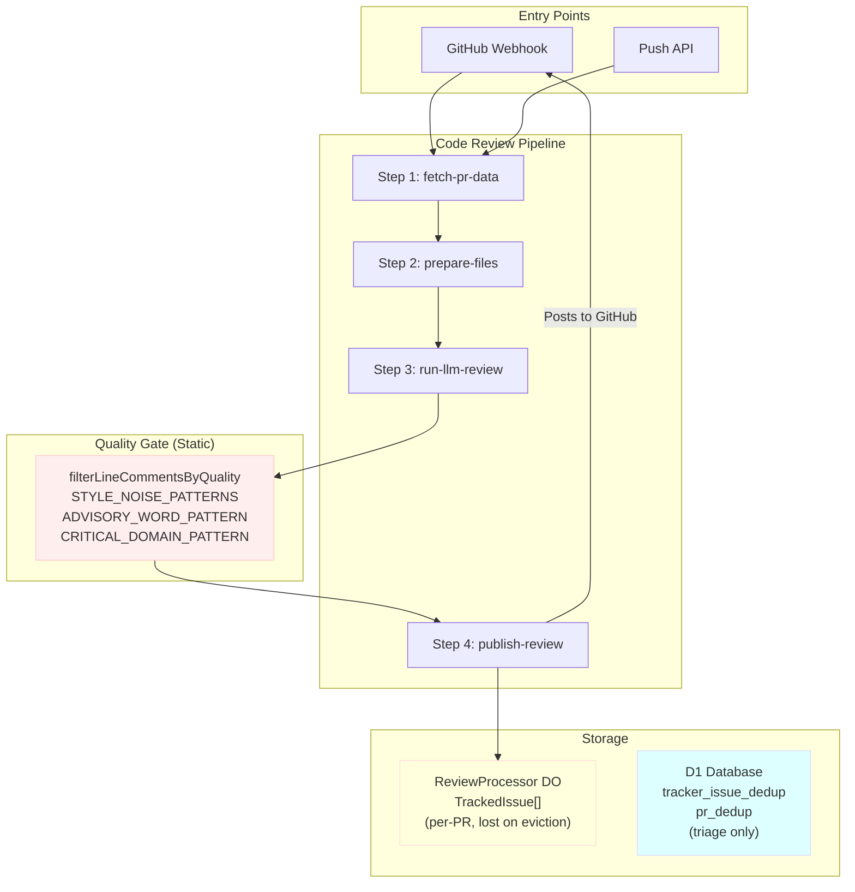
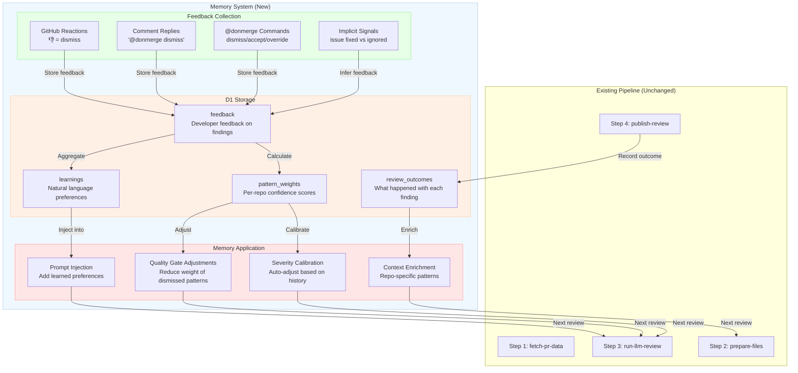
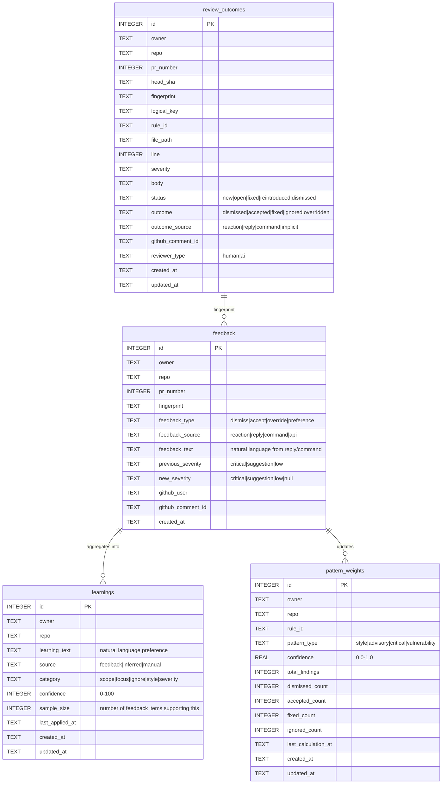
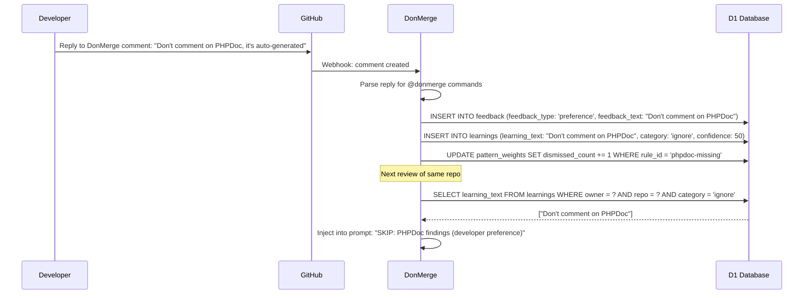
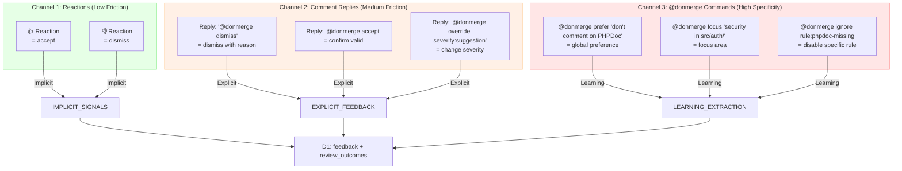
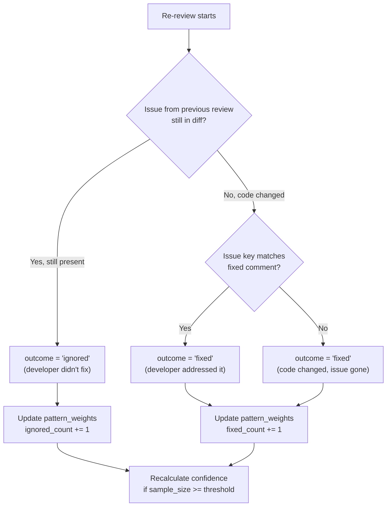
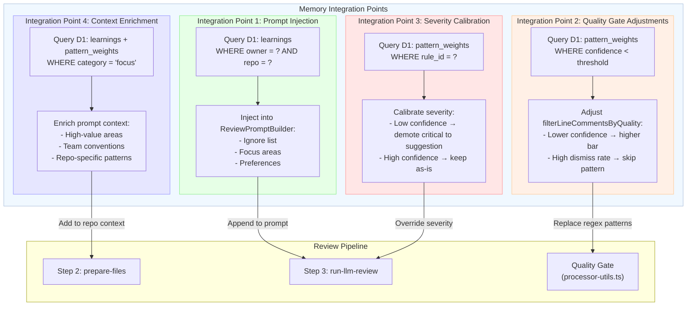

# DonMerge Memory System Design

> **Status:** Draft  
> **Author:** DonMerge Team  
> **Created:** 2026-07-06  
> **Supersedes:** N/A (new feature)

---

## Table of Contents

- [Executive Summary](#executive-summary)
- [Current State Analysis](#current-state-analysis)
- [Proposed Memory System](#proposed-memory-system)
  - [Architecture](#architecture)
  - [D1 Schema Design](#d1-schema-design)
  - [Memory Types](#memory-types)
  - [Feedback Collection](#feedback-collection)
  - [Memory Application](#memory-application)
- [Implementation Phases](#implementation-phases)
- [Comparison with CodeRabbit](#comparison-with-coderabbit)
- [Risk Considerations](#risk-considerations)

---

## Executive Summary

### Why Memory Matters

DonMerge currently operates as a **stateless reviewer** — every PR review starts from scratch with no knowledge of past interactions. This creates several problems:

1. **False positives erode trust.** When DonMerge flags something that was previously dismissed as irrelevant, developers learn to ignore all findings. Without memory of past dismissals, the same false positives repeat indefinitely.

2. **No learning from feedback.** When a developer says "don't comment on PHPDoc" or "focus on security in `src/auth/`", that preference vanishes after the review completes. The next review of the same repo repeats the same patterns.

3. **Static quality gate.** The hardcoded regex patterns in `processor-utils.ts` (STYLE_NOISE_PATTERNS, ADVISORY_WORD_PATTERN, etc.) never evolve. They can't adapt to repo-specific conventions or developer feedback.

4. **Trust erosion cycle.** Repeated false positives → developers disable or ignore DonMerge → missed real issues → reduced value proposition.

### What CodeRabbit Does Differently

CodeRabbit's memory system operates on three levels:

- **Learnings:** Natural language preferences extracted from chat interactions ("don't comment on PHPDoc", "focus on security in `src/auth/`"). These are accumulated over time and injected into future review prompts.

- **Knowledge Base:** Code guidelines, issue trackers, PR context, and multi-repo analysis. This provides persistent context that evolves with the codebase.

- **Acceptance tracking:** Tracks which comments were actually addressed (accepted = verified fix or developer confirmation). This creates a feedback loop that improves the accuracy of future findings.

### What DonMerge Could Learn From

DonMerge can adopt CodeRabbit's core concepts while leveraging its Cloudflare-native architecture for advantages CodeRabbit doesn't have:

| Concept | CodeRabbit Approach | DonMerge Opportunity |
|---------|-------------------|---------------------|
| Storage | PostgreSQL | **D1** — zero-latency edge queries, no external DB |
| Feedback | Chat-based | **Workflow-native** — reactions, comment replies, `@donmerge` commands |
| Learning injection | Prompt prepend | **Prompt builder integration** — existing `ReviewPromptBuilder` pattern |
| Pattern evolution | Manual curation | **Automated confidence scoring** — D1 aggregate queries |
| Scope | Org-level + repo-level | **Repo-level with D1 row-level isolation** |

---

## Current State Analysis

### What Exists vs. What's Missing

| Capability | Status | Implementation |
|-----------|--------|----------------|
| Per-PR issue tracking | ✅ Exists | DO storage (`issue-store.ts`), `TrackedIssue[]` |
| Fingerprint-based dedup | ✅ Exists | `issue-identity.ts`, `computeFingerprint()` |
| Issue state machine | ✅ Exists | `issue-lifecycle.ts` — new/open/fixed/reintroduced |
| Quality gate (regex) | ✅ Exists | `processor-utils.ts` — `filterLineCommentsByQuality()` |
| Severity overrides | ✅ Exists | `.donmerge` config `severity` map |
| Custom instructions | ✅ Exists | `.donmerge` config `instructions` field |
| **Feedback collection** | ❌ Missing | No way to mark findings as useful/false positive |
| **Outcome tracking** | ❌ Missing | No D1 table tracking what happened with findings |
| **Learning persistence** | ❌ Missing | No D1 table storing natural language preferences |
| **Pattern confidence** | ❌ Missing | No per-repo confidence scores for finding types |
| **Memory-influenced reviews** | ❌ Missing | No feedback loop from past reviews to future prompts |

### Current Flow (No Memory Loop)



**Key observation:** The quality gate is purely deterministic regex. D1 exists but is only used for triage dedup. DO storage is per-PR and ephemeral.

---

## Proposed Memory System

### Architecture

The memory system adds a feedback loop to the existing pipeline. After a review completes, developers provide feedback. This feedback accumulates in D1 and influences future reviews.



### D1 Schema Design

#### Entity Relationship Diagram



#### SQL Migration

```sql
-- Migration 0004: Memory system tables for code review learning.
-- Run: wrangler d1 execute donmerge-db --file=migrations/0004_create_memory_tables.sql
-- Run: wrangler d1 execute donmerge-db --file=migrations/0004_create_memory_tables.sql --env staging

-- ── review_outcomes ──────────────────────────────────────────────────────────
-- Records what happened with each finding across all reviews.
-- One row per finding per review run. Used to calculate pattern confidence
-- and detect feedback loops (same finding dismissed repeatedly).

CREATE TABLE IF NOT EXISTS review_outcomes (
  id INTEGER PRIMARY KEY AUTOINCREMENT,
  owner TEXT NOT NULL,
  repo TEXT NOT NULL,
  pr_number INTEGER NOT NULL,
  head_sha TEXT NOT NULL,
  fingerprint TEXT NOT NULL,
  logical_key TEXT NOT NULL,
  rule_id TEXT NOT NULL DEFAULT 'unspecified',
  file_path TEXT NOT NULL,
  line INTEGER NOT NULL,
  severity TEXT NOT NULL CHECK(severity IN ('critical', 'suggestion', 'low')),
  body TEXT NOT NULL DEFAULT '',
  status TEXT NOT NULL DEFAULT 'new' CHECK(status IN ('new', 'open', 'fixed', 'reintroduced', 'dismissed')),
  outcome TEXT NOT NULL DEFAULT 'new' CHECK(outcome IN ('new', 'dismissed', 'accepted', 'fixed', 'ignored', 'overridden')),
  outcome_source TEXT CHECK(outcome_source IN ('reaction', 'reply', 'command', 'implicit', NULL)),
  previous_severity TEXT CHECK(previous_severity IN ('critical', 'suggestion', 'low', NULL)),
  new_severity TEXT CHECK(new_severity IN ('critical', 'suggestion', 'low', NULL)),
  github_comment_id INTEGER,
  reviewer_type TEXT NOT NULL DEFAULT 'ai' CHECK(reviewer_type IN ('human', 'ai')),
  created_at TEXT NOT NULL DEFAULT (datetime('now')),
  updated_at TEXT NOT NULL DEFAULT (datetime('now'))
);

-- Indexes for memory queries
CREATE INDEX IF NOT EXISTS idx_review_outcomes_repo ON review_outcomes(owner, repo);
CREATE INDEX IF NOT EXISTS idx_review_outcomes_fingerprint ON review_outcomes(fingerprint);
CREATE INDEX IF NOT EXISTS idx_review_outcomes_rule ON review_outcomes(owner, repo, rule_id);
CREATE INDEX IF NOT EXISTS idx_review_outcomes_outcome ON review_outcomes(owner, repo, outcome);
CREATE INDEX IF NOT EXISTS idx_review_outcomes_pr ON review_outcomes(owner, repo, pr_number);

-- ── feedback ─────────────────────────────────────────────────────────────────
-- Stores explicit developer feedback on findings.
-- Each feedback item links to a specific finding via fingerprint.
-- Natural language text captures preferences for learning extraction.

CREATE TABLE IF NOT EXISTS feedback (
  id INTEGER PRIMARY KEY AUTOINCREMENT,
  owner TEXT NOT NULL,
  repo TEXT NOT NULL,
  pr_number INTEGER NOT NULL,
  fingerprint TEXT NOT NULL,
  feedback_type TEXT NOT NULL CHECK(feedback_type IN ('dismiss', 'accept', 'override', 'preference')),
  feedback_source TEXT NOT NULL CHECK(feedback_source IN ('reaction', 'reply', 'command', 'api')),
  feedback_text TEXT,
  previous_severity TEXT CHECK(previous_severity IN ('critical', 'suggestion', 'low', NULL)),
  new_severity TEXT CHECK(new_severity IN ('critical', 'suggestion', 'low', NULL)),
  github_user TEXT NOT NULL,
  github_comment_id INTEGER,
  created_at TEXT NOT NULL DEFAULT (datetime('now'))
);

-- Indexes for feedback queries
CREATE INDEX IF NOT EXISTS idx_feedback_repo ON feedback(owner, repo);
CREATE INDEX IF NOT EXISTS idx_feedback_fingerprint ON feedback(fingerprint);
CREATE INDEX IF NOT EXISTS idx_feedback_type ON feedback(owner, repo, feedback_type);
CREATE INDEX IF NOT EXISTS idx_feedback_pr ON feedback(owner, repo, pr_number);

-- ── learnings ────────────────────────────────────────────────────────────────
-- Accumulated natural language preferences from feedback.
-- These are injected into the review prompt to guide future reviews.
-- Scope: repo-level (owner/repo) or global (owner=NULL, repo=NULL).

CREATE TABLE IF NOT EXISTS learnings (
  id INTEGER PRIMARY KEY AUTOINCREMENT,
  owner TEXT,
  repo TEXT,
  learning_text TEXT NOT NULL,
  source TEXT NOT NULL DEFAULT 'feedback' CHECK(source IN ('feedback', 'inferred', 'manual')),
  category TEXT NOT NULL DEFAULT 'focus' CHECK(category IN ('scope', 'focus', 'ignore', 'style', 'severity')),
  confidence INTEGER NOT NULL DEFAULT 50 CHECK(confidence BETWEEN 0 AND 100),
  sample_size INTEGER NOT NULL DEFAULT 1,
  last_applied_at TEXT,
  created_at TEXT NOT NULL DEFAULT (datetime('now')),
  updated_at TEXT NOT NULL DEFAULT (datetime('now'))
);

-- Indexes for learning queries
CREATE INDEX IF NOT EXISTS idx_learnings_repo ON learnings(owner, repo);
CREATE INDEX IF NOT EXISTS idx_learnings_category ON learnings(owner, repo, category);
CREATE INDEX IF NOT EXISTS idx_learnings_global ON learnings(owner, repo) WHERE owner IS NULL;

-- ── pattern_weights ──────────────────────────────────────────────────────────
-- Per-repo confidence scores for each finding type (rule_id).
-- Calculated from aggregated feedback outcomes.
-- Used to adjust the quality gate and severity calibration.

CREATE TABLE IF NOT EXISTS pattern_weights (
  id INTEGER PRIMARY KEY AUTOINCREMENT,
  owner TEXT NOT NULL,
  repo TEXT NOT NULL,
  rule_id TEXT NOT NULL,
  pattern_type TEXT NOT NULL DEFAULT 'unknown' CHECK(pattern_type IN ('style', 'advisory', 'critical', 'vulnerability', 'unknown')),
  confidence REAL NOT NULL DEFAULT 0.5 CHECK(confidence BETWEEN 0.0 AND 1.0),
  total_findings INTEGER NOT NULL DEFAULT 0,
  dismissed_count INTEGER NOT NULL DEFAULT 0,
  accepted_count INTEGER NOT NULL DEFAULT 0,
  fixed_count INTEGER NOT NULL DEFAULT 0,
  ignored_count INTEGER NOT NULL DEFAULT 0,
  last_calculation_at TEXT,
  created_at TEXT NOT NULL DEFAULT (datetime('now')),
  updated_at TEXT NOT NULL DEFAULT (datetime('now')),
  UNIQUE(owner, repo, rule_id)
);

-- Indexes for weight queries
CREATE INDEX IF NOT EXISTS idx_pattern_weights_repo ON pattern_weights(owner, repo);
CREATE INDEX IF NOT EXISTS idx_pattern_weights_confidence ON pattern_weights(owner, repo, confidence);
```

### Memory Types

#### 1. Outcome Memory

**What happened with past findings.**

Outcome memory tracks the lifecycle of each finding across reviews. This is the foundation for all other memory types.

| Outcome | Meaning | Source |
|---------|---------|--------|
| `new` | Just found, no feedback yet | Review pipeline |
| `dismissed` | Developer marked as false positive | 👎 reaction, `@donmerge dismiss` |
| `accepted` | Developer confirmed valid | 👍 reaction, `@donmerge accept` |
| `fixed` | Code was changed to address | Implicit (issue not in next diff) |
| `ignored` | No action taken | Implicit (issue persisted across N reviews) |
| `overridden` | Severity changed by developer | `@donmerge override severity:suggestion` |

**Storage:** `review_outcomes` table in D1.

**Query pattern:**
```sql
-- Get outcome distribution for a rule in a repo
SELECT outcome, COUNT(*) as count
FROM review_outcomes
WHERE owner = ? AND repo = ? AND rule_id = ?
GROUP BY outcome;

-- Calculate confidence for a rule
SELECT
  (accepted_count + fixed_count) * 1.0 / NULLIF(total_findings, 0) as confidence
FROM pattern_weights
WHERE owner = ? AND repo = ? AND rule_id = ?;
```

#### 2. Learning Memory

**Natural language preferences from feedback.**

When a developer provides feedback with natural language (e.g., "don't comment on PHPDoc" or "focus on security in src/auth/"), that preference is extracted and stored as a learning.

| Category | Example | Effect |
|----------|---------|--------|
| `ignore` | "Don't comment on PHPDoc" | Add to prompt exclusion list |
| `focus` | "Focus on security in src/auth/" | Add to prompt focus areas |
| `scope` | "Only review business logic" | Narrow review scope |
| `style` | "Use imperative mood in comments" | Adjust comment style |
| `severity` | "Don't block on import ordering" | Adjust severity thresholds |

**Storage:** `learnings` table in D1.

**Learning extraction flow:**


#### 3. Pattern Memory

**Per-repo confidence scores for finding types.**

Pattern memory aggregates feedback to calculate how reliable each finding type (rule_id) is in a specific repository. This enables the quality gate to evolve beyond static regex.

| Metric | Calculation | Effect |
|--------|-------------|--------|
| **Confidence** | `(accepted + fixed) / total` | Low confidence → lower severity |
| **Dismiss rate** | `dismissed / total` | High dismiss rate → consider dropping |
| **Fix rate** | `fixed / total` | High fix rate → high value finding |
| **Ignored rate** | `ignored / total` | High ignore rate → noise pattern |

**Storage:** `pattern_weights` table in D1.

**Confidence recalculation (run periodically or after N feedback items):**
```sql
-- Recalculate pattern weights for a repo
INSERT INTO pattern_weights (owner, repo, rule_id, pattern_type, confidence, total_findings,
  dismissed_count, accepted_count, fixed_count, ignored_count, last_calculation_at, updated_at)
SELECT
  ro.owner,
  ro.repo,
  ro.rule_id,
  CASE
    WHEN ro.rule_id LIKE '%style%' OR ro.rule_id LIKE '%format%' OR ro.rule_id LIKE '%import%'
      THEN 'style'
    WHEN ro.rule_id LIKE '%sql%' OR ro.rule_id LIKE '%xss%' OR ro.rule_id LIKE '%auth%'
      THEN 'vulnerability'
    WHEN ro.rule_id LIKE '%null%' OR ro.rule_id LIKE '%race%' OR ro.rule_id LIKE '%crash%'
      THEN 'critical'
    ELSE 'unknown'
  END as pattern_type,
  COALESCE(
    (SUM(CASE WHEN ro.outcome IN ('accepted', 'fixed') THEN 1 ELSE 0 END) * 1.0) /
    NULLIF(COUNT(*), 0),
    0.5
  ) as confidence,
  COUNT(*) as total_findings,
  SUM(CASE WHEN ro.outcome = 'dismissed' THEN 1 ELSE 0 END) as dismissed_count,
  SUM(CASE WHEN ro.outcome = 'accepted' THEN 1 ELSE 0 END) as accepted_count,
  SUM(CASE WHEN ro.outcome = 'fixed' THEN 1 ELSE 0 END) as fixed_count,
  SUM(CASE WHEN ro.outcome = 'ignored' THEN 1 ELSE 0 END) as ignored_count,
  datetime('now') as last_calculation_at,
  datetime('now') as updated_at
FROM review_outcomes ro
WHERE ro.owner = ? AND ro.repo = ?
GROUP BY ro.owner, ro.repo, ro.rule_id
ON CONFLICT(owner, repo, rule_id) DO UPDATE SET
  confidence = excluded.confidence,
  total_findings = excluded.total_findings,
  dismissed_count = excluded.dismissed_count,
  accepted_count = excluded.accepted_count,
  fixed_count = excluded.fixed_count,
  ignored_count = excluded.ignored_count,
  last_calculation_at = excluded.last_calculation_at,
  updated_at = excluded.updated_at;
```

#### 4. Context Memory

**Repo-specific code patterns and conventions.**

Context memory is derived from outcome and pattern memory. It provides the reviewer with knowledge about what matters in a specific codebase.

| Context Type | Source | Example |
|-------------|--------|---------|
| **File importance** | Outcome history | `src/auth/` has 90% critical findings |
| **Common patterns** | Pattern weights | "N+1 queries are real in this codebase" |
| **Developer preferences** | Learnings | "Team prefers explicit error handling" |
| **Ignored areas** | Dismiss history | "Don't flag test file formatting" |

**Storage:** Derived from `pattern_weights` and `learnings` tables.

**Query pattern:**
```sql
-- Get high-confidence findings for a repo (for prompt enrichment)
SELECT rule_id, confidence, total_findings
FROM pattern_weights
WHERE owner = ? AND repo = ? AND confidence > 0.7 AND total_findings >= 5
ORDER BY confidence DESC
LIMIT 10;

-- Get all ignore learnings for a repo
SELECT learning_text
FROM learnings
WHERE (owner = ? AND repo = ?) OR (owner IS NULL AND repo IS NULL)
AND category = 'ignore'
AND confidence >= 50;
```

### Feedback Collection

#### How Developers Provide Feedback

DonMerge will collect feedback through three channels, each with increasing specificity:



#### Feedback Types

| Type | Trigger | Storage | Effect |
|------|---------|---------|--------|
| `dismiss` | 👎 reaction or `@donmerge dismiss` | `feedback.feedback_type = 'dismiss'` | Increases dismissed_count for rule_id |
| `accept` | 👍 reaction or `@donmerge accept` | `feedback.feedback_type = 'accept'` | Increases accepted_count for rule_id |
| `override` | `@donmerge override severity:X` | `feedback.feedback_type = 'override'` | Changes severity for this finding |
| `preference` | `@donmerge prefer '...'` | `feedback.feedback_type = 'preference'` | Creates/updates learning |
| `implicit` | Issue fixed in next commit | `review_outcomes.outcome = 'fixed'` | Increases fixed_count for rule_id |

#### Implicit Signal Detection

When DonMerge runs a re-review, it can infer feedback from what happened to previous findings:



### Memory Application

#### How Memory Influences Future Reviews

Memory is applied at four integration points in the existing pipeline:



#### Integration Point 1: Prompt Injection

**Location:** `ReviewPromptBuilder.build()` in `prompts/builder.ts`

The existing builder already supports custom instructions via `.donmerge` config. Memory injection adds learned preferences as an additional section.

```typescript
// New method on ReviewPromptBuilder
withMemoryContext(memoryContext: MemoryContext): this {
  if (memoryContext.ignorePatterns.length > 0) {
    this.addSection(
      `🧠 LEARNED PREFERENCES (from developer feedback):\n` +
      `SKIP these finding types — developers have confirmed they are not relevant:\n` +
      memoryContext.ignorePatterns.map(p => `- ${p}`).join('\n')
    );
  }
  if (memoryContext.focusAreas.length > 0) {
    this.addSection(
      `🎯 FOCUS AREAS (from developer feedback):\n` +
      `Pay special attention to:\n` +
      memoryContext.focusAreas.map(f => `- ${f}`).join('\n')
    );
  }
  if (memoryContext.preferences.length > 0) {
    this.addSection(
      `📝 TEAM PREFERENCES:\n` +
      memoryContext.preferences.map(p => `- ${p}`).join('\n')
    );
  }
  return this;
}
```

#### Integration Point 2: Quality Gate Adjustments

**Location:** `filterLineCommentsByQuality()` in `processor-utils.ts`

The existing quality gate uses static regex patterns. Memory-influenced gate adds dynamic thresholds based on pattern confidence.

```typescript
// Modified quality gate with memory awareness
export function filterLineCommentsByQuality(
  comments: ReviewComment[],
  patternWeights?: Map<string, PatternWeight>  // NEW parameter
): ReviewComment[] {
  return comments
    .filter((comment) => shouldKeepLineComment(comment, patternWeights))
    .map((comment) => adjustSeverityByConfidence(comment, patternWeights));
}

function shouldKeepLineComment(
  comment: ReviewComment,
  patternWeights?: Map<string, PatternWeight>
): boolean {
  // Existing regex logic (unchanged)
  const body = comment.body ?? '';
  const searchable = `${body}\n${comment.issueKey ?? ''}\n${comment.ruleId ?? ''}`;

  // ... existing regex checks ...

  // NEW: Check pattern confidence
  if (patternWeights && comment.ruleId) {
    const weight = patternWeights.get(comment.ruleId);
    if (weight && weight.confidence < 0.3 && weight.total_findings >= 10) {
      // Low confidence pattern with sufficient sample size → drop
      return false;
    }
  }

  return true;
}
```

#### Integration Point 3: Severity Calibration

**Location:** `normalizeReviewResult()` in `processor-utils.ts`

After the LLM produces findings, memory adjusts severity based on historical accuracy.

```typescript
// Modified severity calibration
function calibrateSeverity(
  comment: ReviewComment,
  patternWeights?: Map<string, PatternWeight>
): ReviewComment {
  if (!patternWeights || !comment.ruleId) return comment;

  const weight = patternWeights.get(comment.ruleId);
  if (!weight) return comment;

  // If confidence is low and severity is critical, demote to suggestion
  if (weight.confidence < 0.4 && comment.severity === 'critical' && weight.total_findings >= 5) {
    return {
      ...comment,
      severity: 'suggestion',
      body: comment.body.replace(/🔴\s*\*\*Issue:\*\*/i, '🟡 **Suggestion:**'),
    };
  }

  return comment;
}
```

#### Integration Point 4: Context Enrichment

**Location:** `prepareFiles()` in `code-review-workflow.ts`

Before the review starts, memory enriches the repo context with learned patterns.

```typescript
// New function to build memory context
async function buildMemoryContext(
  db: D1Database,
  owner: string,
  repo: string
): Promise<MemoryContext> {
  // Get ignore learnings
  const ignoreResult = await db.prepare(
    `SELECT learning_text FROM learnings
     WHERE (owner = ? AND repo = ?) OR (owner IS NULL AND repo IS NULL)
     AND category = 'ignore' AND confidence >= 50`
  ).bind(owner, repo).all();

  // Get focus learnings
  const focusResult = await db.prepare(
    `SELECT learning_text FROM learnings
     WHERE (owner = ? AND repo = ?) OR (owner IS NULL AND repo IS NULL)
     AND category = 'focus' AND confidence >= 50`
  ).bind(owner, repo).all();

  // Get high-confidence patterns
  const patternsResult = await db.prepare(
    `SELECT rule_id, confidence FROM pattern_weights
     WHERE owner = ? AND repo = ? AND confidence > 0.7 AND total_findings >= 5`
  ).bind(owner, repo).all();

  return {
    ignorePatterns: ignoreResult.results.map(r => r.learning_text as string),
    focusAreas: focusResult.results.map(r => r.learning_text as string),
    highConfidenceRules: patternsResult.results.map(r => ({
      ruleId: r.rule_id as string,
      confidence: r.confidence as number,
    })),
    preferences: [], // Will be populated from preference learnings
  };
}
```

---

## Implementation Phases

### Phase 1: Feedback Collection (Week 1-2)

**Goal:** Capture developer feedback on findings.

| Task | Files | Description |
|------|-------|-------------|
| Add D1 binding to code-review env | `wrangler.jsonc`, `types.ts` | Add `DB?: D1Database` to WorkflowEnv |
| Create migration 0004 | `migrations/0004_create_memory_tables.sql` | Schema for memory tables |
| Implement feedback webhook handler | `github-api.ts` | Parse reactions + comment replies |
| Add `@donmerge` command parser | `utils.ts` | Parse dismiss/accept/override/preference commands |
| Store feedback in D1 | `feedback-store.ts` (new) | INSERT into feedback + review_outcomes tables |
| Record outcomes on review publish | `code-review-workflow.ts` | INSERT into review_outcomes in Step 4 |

**Deliverable:** Every review records outcomes. Developers can provide feedback via reactions and `@donmerge` commands.

### Phase 2: D1 Schema + Storage Layer (Week 2-3)

**Goal:** Persistent storage with query patterns for memory retrieval.

| Task | Files | Description |
|------|-------|-------------|
| Create migration 0004 | `migrations/0004_create_memory_tables.sql` | Full schema with indexes |
| Implement `memory-store.ts` (new) | `src/workflows/code-review/memory-store.ts` | D1 query functions |
| Implement `pattern-recalculator.ts` (new) | `src/workflows/code-review/pattern-recalculator.ts` | Aggregate feedback → pattern_weights |
| Add D1 access to Workflow | `code-review-workflow.ts` | Pass `env.DB` through pipeline |
| Unit tests for memory-store | `__tests__/memory-store.test.ts` | Mock D1, test queries |

**Deliverable:** Memory store with CRUD operations. Pattern weights calculated from feedback.

### Phase 3: Memory Application — Prompt Injection (Week 3-4)

**Goal:** Memory influences LLM review prompts.

| Task | Files | Description |
|------|-------|-------------|
| Extend `ReviewPromptBuilder` | `prompts/builder.ts` | Add `withMemoryContext()` method |
| Add memory context query | `memory-store.ts` | Query learnings + pattern_weights |
| Integrate into `prepareFiles()` | `code-review-workflow.ts` | Build memory context, pass to builder |
| Add memory template section | `prompts/templates.ts` | `MEMORY_HEADER`, `IGNORE_PATTERNS`, etc. |
| Integration tests | `__tests__/code-review-workflow.test.ts` | Test memory injection end-to-end |

**Deliverable:** Reviews include learned preferences in the prompt.

### Phase 4: Pattern Learning — Quality Gate Evolution (Week 4-5)

**Goal:** Quality gate adapts based on historical accuracy.

| Task | Files | Description |
|------|-------|-------------|
| Modify `filterLineCommentsByQuality()` | `processor-utils.ts` | Accept optional `patternWeights` parameter |
| Add severity calibration | `processor-utils.ts` | `calibrateSeverity()` function |
| Wire pattern weights into pipeline | `code-review-workflow.ts` | Query weights, pass to quality gate |
| Add confidence threshold config | `types.ts` | `MEMORY_CONFIDENCE_THRESHOLD` env var |
| Update existing tests | `processor-utils.test.ts` | Test with mock pattern weights |

**Deliverable:** Quality gate uses historical accuracy to filter and adjust findings.

### Phase 5: Dashboard and Analytics (Week 5-6)

**Goal:** Visibility into memory system performance.

| Task | Files | Description |
|------|-------|-------------|
| Add analytics API endpoints | `api/routes.ts` | `GET /api/v1/memory/stats/:owner/:repo` |
| Implement stats queries | `memory-store.ts` | Aggregate queries for dashboard |
| Add learning management API | `api/routes.ts` | CRUD for learnings (admin) |
| Add opt-out mechanism | `donmerge.ts` | `memory.enabled: false` in `.donmerge` |
| Create admin dashboard (optional) | New Cloudflare Pages app | Visualize learnings, patterns, feedback |

**Deliverable:** Admin visibility into memory system. Opt-out capability.

---

## Comparison with CodeRabbit

### Feature Comparison

| Feature | CodeRabbit | DonMerge | Notes |
|---------|-----------|----------|-------|
| **Storage** | PostgreSQL | **D1** | Edge-native, zero-latency |
| **Feedback channels** | Chat-based | **Reactions + commands + replies** | More GitHub-native |
| **Learning injection** | Prompt prepend | **Prompt builder integration** | Existing pattern, testable |
| **Pattern evolution** | Manual curation | **Automated confidence scoring** | Data-driven |
| **Acceptance tracking** | Chat confirmation | **Implicit + explicit signals** | Less friction |
| **Scope control** | Org + repo | **Repo + global** | D1 row-level isolation |
| **Approval flow** | Admin approve/reject | **Confidence thresholds** | Automated |
| **Opt-out** | Team settings | **`.donmerge` config** | Per-repo |
| **Dashboard** | Built-in KPIs | **API + optional Pages app** | Extensible |
| **Self-hosted** | No (SaaS only) | **Yes** | Full control |
| **Pricing** | Per-seat | **Free (self-hosted)** | No per-seat cost |

### What DonMerge Can Do Better

1. **D1-Native:** No external database. Edge queries with <50ms latency globally. No connection pooling, no failover management.

2. **Workflow-Native:** Feedback collection happens inside the existing Cloudflare Workflow pipeline. No separate service or cron job needed.

3. **Simpler Architecture:** Four D1 tables vs. CodeRabbit's complex multi-service architecture. Easier to understand, debug, and maintain.

4. **Transparent:** All logic is in the open-source codebase. Teams can inspect exactly how their data is used.

5. **No Vendor Lock-in:** Self-hosted on Cloudflare Workers. Data stays in the team's D1 database.

6. **Implicit Signal Detection:** DonMerge already tracks issue lifecycle (new/open/fixed/reintroduced). This creates automatic feedback without developer action.

---

## Risk Considerations

### Privacy

| Risk | Mitigation |
|------|------------|
| **Code snippets in D1** | `review_outcomes.body` stores comment text, not code. `fingerprint` is a hash, not raw content. |
| **Feedback contains PII** | `github_user` is GitHub username (public). No email or personal data stored. |
| **Learning text contains sensitive info** | Learning text is developer-provided preferences, not code. Can be deleted via API. |
| **Data retention** | Add configurable TTL: `MEMORY_RETENTION_DAYS` env var (default: 90 days). Auto-purge old records. |

### Accuracy

| Risk | Mitigation |
|------|------------|
| **Feedback loops** | Confidence scores require minimum sample size (`total_findings >= 5`) before influencing decisions. Prevents overfitting to 1-2 feedback items. |
| **Biased feedback** | Only feedback from the PR author or repo collaborators is recorded. External contributor feedback is ignored. |
| **Stale learnings** | Learnings have `last_applied_at` timestamp. If not applied in 30 days, confidence decays by 10%. |
| **False positive learnings** | Learning confidence starts at 50%. Requires 3+ consistent feedback items to reach 80%+ confidence. |

### Performance

| Risk | Mitigation |
|------|------------|
| **D1 query latency** | All queries use indexed columns. Expected latency: <50ms for reads, <100ms for writes. |
| **Review latency increase** | Memory queries happen in Step 1 (fetch-pr-data), not blocking the critical path. |
| **D1 read limits** | Free tier: 100K reads/day. With 100 reviews/day × 4 queries/review = 400 reads/day. Well within limits. |
| **D1 write limits** | Free tier: 50K writes/day. With 100 reviews/day × 2 writes/review + 50 feedback/day × 2 writes/feedback = 300 writes/day. Well within limits. |

### Cost

| Resource | Free Tier | Expected Usage | Cost |
|----------|-----------|----------------|------|
| D1 Storage | 5 GB | ~10 MB (10K reviews × 1KB/review) | $0 |
| D1 Reads | 100K/day | ~400/day | $0 |
| D1 Writes | 50K/day | ~300/day | $0 |
| D1 Row Writes | 50M/month | ~9K/month | $0 |

**Total additional cost: $0** (within free tier for reasonable usage).

### Opt-Out Mechanism

Teams can disable memory at the repo level:

```yaml
# .donmerge
version: "1"
memory:
  enabled: false  # Disable all memory features
  retention_days: 90  # Auto-delete data after 90 days
  categories:  # Selectively disable categories
    - learnings
    - pattern_weights
    # - feedback  # Keep feedback but don't learn from it
```

---

## Appendix: Files to Create/Modify

### New Files

| File | Purpose |
|------|---------|
| `migrations/0004_create_memory_tables.sql` | D1 schema for memory tables |
| `src/workflows/code-review/memory-store.ts` | D1 query functions for memory |
| `src/workflows/code-review/pattern-recalculator.ts` | Aggregate feedback → pattern_weights |
| `src/workflows/code-review/feedback-handler.ts` | Parse and store developer feedback |
| `src/workflows/code-review/__tests__/memory-store.test.ts` | Unit tests for memory store |
| `src/workflows/code-review/__tests__/feedback-handler.test.ts` | Unit tests for feedback handler |

### Modified Files

| File | Changes |
|------|---------|
| `wrangler.jsonc` | Add `DB` binding to code-review workflow env |
| `src/workflows/code-review/types.ts` | Add `MemoryContext`, `PatternWeight`, `Learning` types |
| `src/workflows/code-review/code-review-workflow.ts` | Integrate memory queries + feedback recording |
| `src/workflows/code-review/prompts/builder.ts` | Add `withMemoryContext()` method |
| `src/workflows/code-review/prompts/templates.ts` | Add memory template sections |
| `src/workflows/code-review/processor-utils.ts` | Accept `patternWeights` in quality gate |
| `src/workflows/code-review/github-api.ts` | Parse reactions + comment replies for feedback |
| `src/workflows/code-review/utils.ts` | Add `@donmerge` command parser |

---

## Appendix: Environment Variables

| Variable | Required | Default | Description |
|----------|----------|---------|-------------|
| `MEMORY_ENABLED` | No | `true` | Enable/disable memory system globally |
| `MEMORY_CONFIDENCE_THRESHOLD` | No | `0.3` | Minimum confidence to influence quality gate |
| `MEMORY_MIN_SAMPLE_SIZE` | No | `5` | Minimum feedback items before pattern influences decisions |
| `MEMORY_LEARNING_DECAY_DAYS` | No | `30` | Days before unused learnings lose confidence |
| `MEMORY_RETENTION_DAYS` | No | `90` | Days before old records are purged |
| `MEMORY_RECALCULATE_AFTER` | No | `10` | Recalculate pattern weights after N new feedback items |

---

*End of design document.*
